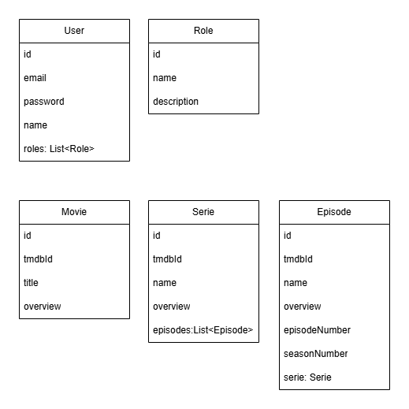
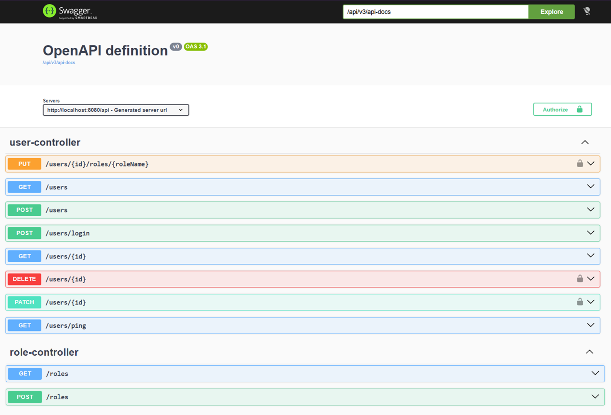
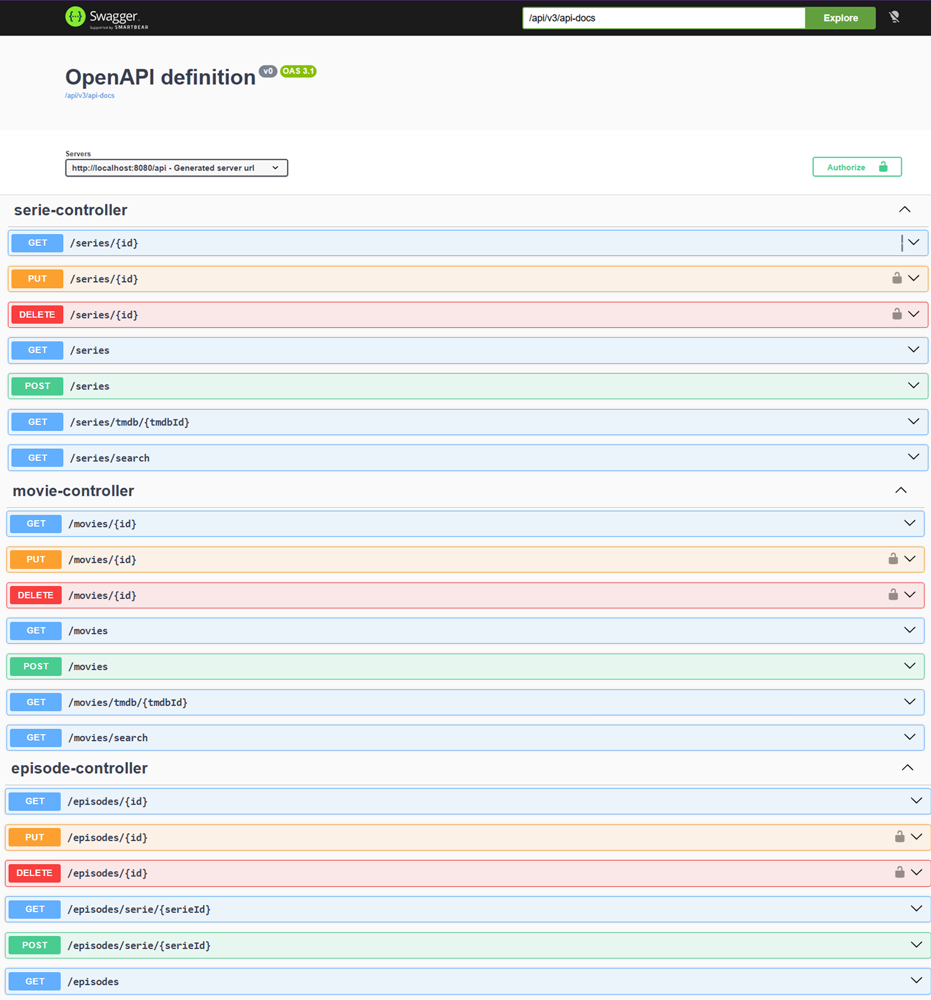

# AuthServer

## API REST utilizando Spring Boot com Kotlin

### Curso:
* Pós-Graduação em Desenvolvimento de aplicativos móveis - PUCPR

### Disciplina:
* Desenvolvimento Backend

## Ferramentas
As seguintes ferramentas foram usadas na construção do projeto:

### 👉 **_Backend_**

- Kotlin
- Spring Boot
- Spring Data JPA
- Spring Security
- Spring Validation
- Spring Doc
- Jwt (JSON Web Token)

### 👉 **_Desenvolvimento Geral_**

- Editor:
  - IntelliJ IDEA
- Reuniões:
  - Teams
- Diagramas:
  - Draw.io

## Introdução

Este projeto possui o objetivo principal **implementar uma API para autenticação e gerenciamento de informações sobre filmes e séries**.

### Vídeo explicativo do projeto

[Youtube](https://youtu.be/Y_jjNYDQxIs)

## Análise técnica

### Requisitos Funcionais

* **RF01** - Cadastro de Usuário: O sistema deve permitir que novos usuários se registrem fornecendo nome, e-mail e senha.
* **RF02** - Login de Usuário: O sistema deve autenticar usuários e retornar um token de acesso (JWT).
* **RF03** - Diferenciação de Níveis de Acesso: O sistema deve validar permissões (ex: Admin pode editar/excluir; User pode apenas visualizar e cadastrar).
* **RF04** - Manutenção de Títulos: O sistema deve permitir criar, ler, atualizar e excluir (CRUD) registros de filmes e séries.
* **RF05** - Manutenção de Episódios: O sistema deve permitir o CRUD de episódios vinculados a uma série. 

### Diagrama de Classes de Domínio

A ideia do diagrama de classes de domínio é fornecer uma documentação enxuta que será utilizada como ponto de partida para o desenvolvimento do projeto, sem a preocupação com os demais detalhes da UML.

### Descrição do ambiente técnico

O sistema é composto por um API http que segue o padrão de arquitetura REST.

### Documentação da API - Imagens do Sistema

Endpoints de Usuários e Autenticação

Endpoints de Filmes, Séries e Episódios

### Padrão Arquitetural

Foi utilizado o padrão de arquitetura REST para a construção do projeto.
Para organização código foi utilizado a separação por domínio de negócio com foco em modularidade.

### Boas práticas aplicadas

* Injeção de Dependências
* Logs
* Tratamento de Erros
* Documentação com Spring Doc

### Processo de Desenvolvimento de Software - PDS

O PDS segue a metodologia ágil sendo uma abordagem interativa incremental.

### Links do Projeto
* [Official Gradle documentation](https://docs.gradle.org)
* [Spring Boot Gradle Plugin Reference Guide](https://docs.spring.io/spring-boot/4.0.5/gradle-plugin)
* [Spring Web](https://docs.spring.io/spring-boot/4.0.5/reference/web/servlet.html)
* [Validation](https://docs.spring.io/spring-boot/4.0.5/reference/io/validation.html)
* [SpringDoc OpenAPI](https://springdoc.org/)

### 👨‍💻 Responsável

<table border="0" align="left">
  <tr>
    <td align="center">
       
      
        <a href="https://github.com/alanserafim"> Alan </a>
      
    </td>
  </tr>
</table>
